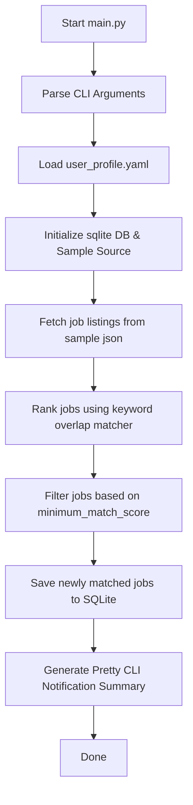

# 🤖 AI Job Scout Agent

A local-first, autonomous AI-powered Job Scout Agent built as a prototype capstone project for the Kaggle/Google Agentic AI course.

The **AI Job Scout Agent** acts as a personalized job search assistant. It runs locally, fetches job listings, extracts structured metadata, ranks matches based on a detailed YAML profile, saves matched listings to a SQLite database, and prints a formatted notifications summary to the console.

---

## 📖 Problem Statement

AI/ML practitioners face a fragmented, noisy job market. Manually scanning multiple job boards, identifying whether roles match complex personal criteria (e.g., PhD requirements, specific frameworks, remote preferences, and avoidance of legacy stacks), and tracking application histories is time-consuming.

Existing alert systems are broad, keyword-based, and cannot assess semantic alignment or match-quality thresholds. The **AI Job Scout Agent** solves this by establishing a **local-first, automated pipeline** that filters and ranks job postings using customizable user profile criteria.

---

## ✨ Features Implemented

*   **Modular Agent Architecture**: Highly structured directory design (`src/`) separating scraping, parsing, ranking, storage, and notification responsibilities.
*   **YAML User Profiles**: Configured with PhD-level targeting parameters (target roles, preferred skills, location constraints, and keyword matching lists).
*   **Sample Data Pipeline**: Standardized mock datasource (`data/sample_jobs.json`) to validate the parser, matcher, persistence, and logger without API calls.
*   **Keyword Overlap Matcher**: Scoring algorithm analyzing job match percentages across target roles (30%), required skills (40%), and keyword matches (30%), while penalizing unwanted tech stacks.
*   **Matched Job Persistence**: Auto-initializing SQLite database (`JobDatabase`) that stores matched jobs with columns for skills list serialization and utilizes URLs as a unique index to prevent duplicate entries.
*   **Pretty Text Summarizer**: `JobNotifier` that outputs a formatted summary of match highlights to the CLI.
*   **Flexible CLI Support**: Built-in parser (`argparse`) supporting source selection and custom minimum match score overrides for dynamic searches.
*   **Robust Test Suite**: 17 unit and integration tests covering profile validation, database operations, matcher algorithms, CLI overrides, and agent pipeline loops.

---

## 🔄 Current Pipeline



---

## 📂 Project Structure

```
ai-job-scout-agent/
├── config/                 # User preferences
│   └── user_profile.yaml   # Target roles, skills, and match thresholds
├── data/                   # Data directory
│   ├── sample_jobs.json    # Local test postings database
│   └── job_scout.db        # SQLite database (created on first run)
├── docs/                   # Extended documentation
│   ├── architecture.md     # In-depth architectural designs
│   └── demo_script.md      # Prototype video demonstration script
├── src/                    # Main package source
│   ├── agent/              # Central agent orchestrator
│   ├── config/             # Settings and YAML loaders
│   ├── notifications/      # Formatted console outputs
│   ├── ranking/            # Job match scoring heuristics
│   ├── sources/            # Scrapers and mockup sources
│   └── storage/            # SQLite adapters
├── tests/                  # Pytest verification suites
├── pyproject.toml          # Project packaging configuration
├── requirements.txt        # Virtual environment dependencies list
└── main.py                 # CLI entry point script
```

---

## 🛠️ Setup & Installation

### Prerequisites
*   Python `3.10` or higher
*   Git

### 1. Clone the Repository
```bash
git clone https://github.com/<your-username>/ai-job-scout-agent.git
cd ai-job-scout-agent
```

### 2. Create and Activate a Virtual Environment
```bash
# Create environment
python3 -m venv .venv

# Activate (macOS/Linux)
source .venv/bin/activate

# Activate (Windows)
.venv\Scripts\activate
```

### 3. Install Dependencies
```bash
pip install -r requirements.txt
# Or install as an editable package
pip install -e .
```

### 4. Configure Environment variables
Copy the template variables file:
```bash
cp .env.example .env
```

---

## 🏃 Running the Project

### Basic Run
Execute the standard search using the settings defined in your YAML profile:
```bash
python3 main.py
```

### Override Minimum Match Score
To run a wider or narrower search than the default profile threshold (`0.75`), specify an override:
```bash
# Set score threshold to 0.65 to match 3 jobs (capturing Vision Scientist job)
python3 main.py --min-score 0.65
```

### Run Tests
Execute the pytest suite to verify all modules work correctly:
```bash
pytest
```

---

## 📊 Example Command Outputs

### Execution with Default Threshold (`0.75`)
```text
==================================================
🤖 Starting AI Job Scout Agent...
📡 Selected Source: sample
==================================================
2026-07-04 19:21:05,103 - src.agent.scout - INFO - Initializing AI Job Scout Agent...
2026-07-04 19:21:05,103 - src.agent.scout - INFO - Loading user profile from: /Users/sarajahromi/Desktop/ai-job-scout-agent/config/user_profile.yaml
2026-07-04 19:21:05,105 - src.agent.scout - INFO - User profile loaded and validated successfully.
2026-07-04 19:21:05,105 - src.agent.scout - INFO - AI Job Scout Agent starting pipeline execution.
2026-07-04 19:21:05,105 - src.agent.scout - INFO - Step 1: Fetching job postings from SampleJobSource...
2026-07-04 19:21:05,105 - src.agent.scout - INFO - Loaded 5 job postings.
2026-07-04 19:21:05,106 - src.agent.scout - INFO - Step 2: Extracting job metadata (Stubbed)...
2026-07-04 19:21:05,106 - src.agent.scout - INFO - Step 3: Ranking jobs based on user profile...
2026-07-04 19:21:05,106 - src.agent.scout - INFO - --- Matching Summary ---
2026-07-04 19:21:05,106 - src.agent.scout - INFO - Total Jobs Loaded: 5
2026-07-04 19:21:05,106 - src.agent.scout - INFO - Matched Jobs Count: 2
2026-07-04 19:21:05,106 - src.agent.scout - INFO - Rejected Jobs Count: 3
2026-07-04 19:21:05,106 - src.agent.scout - INFO - Matched Job Listings:
2026-07-04 19:21:05,106 - src.agent.scout - INFO -   [0.78] Machine Learning Engineer - Reinforcement Learning at Autonomous Systems Corp
2026-07-04 19:21:05,106 - src.agent.scout - INFO -   [0.76] AI Research Engineer, Large Language Models at DeepMind Technologies
2026-07-04 19:21:05,106 - src.agent.scout - INFO - ------------------------
2026-07-04 19:21:05,106 - src.agent.scout - INFO - Step 4: Persisting matched results to SQLite database...
2026-07-04 19:21:05,109 - src.agent.scout - INFO - Saved 2 new matched jobs to the database (out of 2 matched).
2026-07-04 19:21:05,109 - src.agent.scout - INFO - Step 5: Generating notification summary...
2026-07-04 19:21:05,109 - src.agent.scout - INFO - 
==================================================
📢 AI JOB SCOUT: NEW MATCHES FOUND!
==================================================
1. Machine Learning Engineer - Reinforcement Learning at Autonomous Systems Corp
   📍 Location: Seattle, WA
   📊 Match Score: 0.78
   🔗 Link: https://example.com/jobs/asc-ml-engineer-rl

2. AI Research Engineer, Large Language Models at DeepMind Technologies
   📍 Location: San Francisco, CA
   📊 Match Score: 0.76
   🔗 Link: https://example.com/jobs/deepmind-ai-research-engineer

==================================================
2026-07-04 19:21:05,109 - src.agent.scout - INFO - Pipeline executed successfully.
==================================================
🎯 Target Roles: Machine Learning Engineer, ML Engineer, AI Research Engineer, Applied Scientist, Research Scientist, AI Engineer
📊 Minimum Match Score: 0.75
==================================================
==================================================
🤖 Agent execution finished.
==================================================
```

---

## 🗺️ Roadmap & Future Work

*   **Gemini API Integrations (Phase 2 & 3)**:
    *   Deploy **Google GenAI SDK (`google-genai`)** to parse unformatted web scraping job descriptions into typed schema models.
    *   Transition from heuristic keyword mapping to LLM-guided **semantic candidate-to-job matching** (e.g. evaluating context of experience and research contributions).
*   **Web Scrapers & Real API Sources**:
    *   Develop API search scrapers and integrations for LinkedIn, Indeed, Greenhouse, Lever, Remotive, Arbeitnow, Apify, and Google Search API to load real-time AI/ML opportunities.
*   **Automatic Cron Schedules**:
    *   Establish background daemon tasks to execute searches daily.
*   **Real Notifications**:
    *   Implement SMTP mail dispatches and Slack Webhooks to immediately alert when top-tier listings are discovered.
